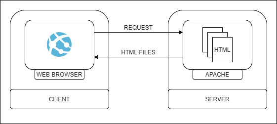
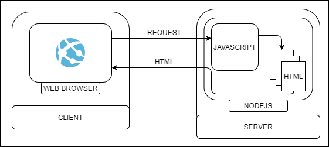
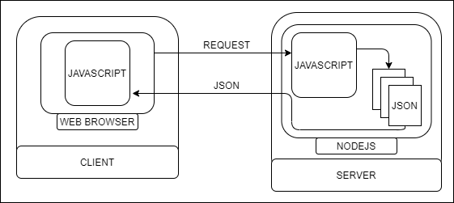

## Web Development

### The Evolution of Web Development

O desenvolvimento web encarou desde com o passar do tempo diversas evolucoes, o que e de fato muito comum com qualquer vertente da tecnologia, passando por diversos paradigmas, linguagens e praticas mais comuns em mercado.

### Client / Server Model

O modelo cliente e servidor pode ser entendido como um modelo para software, onde um servico eh prestado ao seu client, o mesmo computador pode agir ao mesmo tempo com client e server, ja que essa situacao nao diz respeito a maquina, mas sim ao comportamento de a specific software.

### Paradigms

#### Static Pages

Um dos primeiros paradigmas do desenvolvimento web, onde as paginas eram totalmente estaticas, como o proprio nome ja diz, sendo que qualquer alteracao no site, demandaria a alteracao do "source-code" do mesmo, por assim dizer.

#### Dynamic Pages

Uma evolucao de paradigma foi a geracao dinamica de paginas, onde nao mais se faz necessario ficar alterando o "source-code" para cada nova informacao que queremos alterar ou ate mesmo remover, agora esses arquivos sao gerados por um codigo rodando no server, quando o client send a request to the server.

Com a evolucao das tecnologias utilizadas tanto no desenvolvimento Front-End quanto Back-End foi adotado a metodologia de gerar arquivos estruturados e mandar para o client, sendo assim responsabilidade do Web Browser transformar os arquivos enviados em uma Web Page de fato, poupando dessa maneira server computacional resource.

Muitos formatos para esses arquivos estruturados enviados ao client foram utilizados, como o obsoleto XML, que foi substituido pelo JSON(JavaScript Object Notation), dado a grande utilizacao do JavaScript em both ambients.

#### Full Stack
